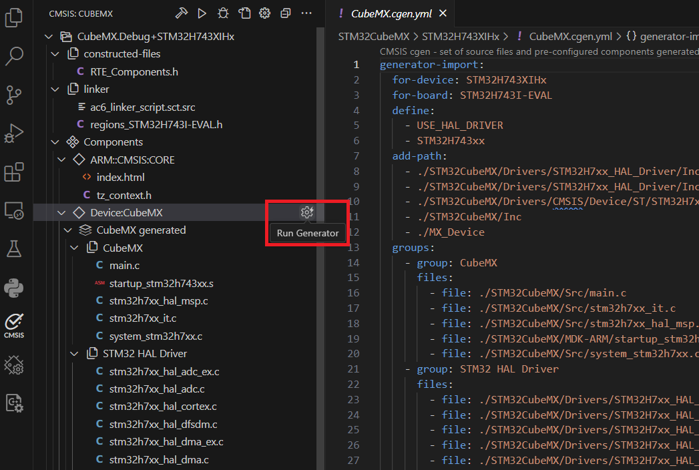
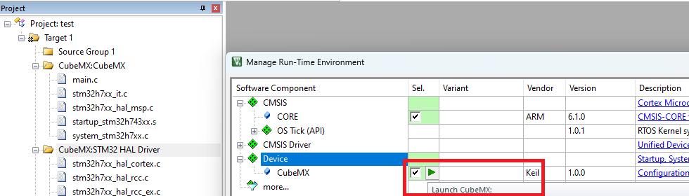

# Introduction

The **STMicroelectronics STM32H7 Series Device Family Pack (DFP)** is a [CMSIS-Pack](https://open-cmsis-pack.github.io/Open-CMSIS-Pack-Spec/main/html/index.html) that:

- Enables compatible tools with device support.
- Supports Arm Compiler 6 (AC6), GCC, and IAR.
- Contains [System View Description (SVD)](https://open-cmsis-pack.github.io/svd-spec/main/index.html) descriptions of the peripherals.
- Flash algorithms for the on-chip Flash memory.
- Debug configuration information.

## CMSIS-Driver Support

This DFP is tested with the [CMSIS-Driver_STM32](https://www.keil.arm.com/packs/cmsis-driver_stm32-arm) pack that implements [CMSIS-Driver](https://arm-software.github.io/CMSIS_6/latest/Driver/index.html) interfaces using a shim layer to the STM32Cube HAL. The following drivers are supported.

```yml
  - component: CMSIS-Driver:Ethernet MAC     # Ethernet MAC Driver for STM32 devices
  - component: CMSIS-Driver:GPIO             # GPIO Driver for STM32 devices
  - component: CMSIS-Driver:I2C              # I2C Driver for STM32 devices
  - component: CMSIS-Driver:MCI              # MCI Driver for STM32 devices
  - component: CMSIS-Driver:SPI              # SPI Driver for STM32 devices
  - component: CMSIS-Driver:USART            # USART Driver for STM32 devices
  - component: CMSIS-Driver:USB Device       # USB Device Driver for STM32 devices
  - component: CMSIS-Driver:USB Host         # USB Host Driver for STM32 devices
```

## CubeMX Support

The device is configured using [STM32CubeMX](https://www.st.com/en/development-tools/stm32cubemx.html) (CubeMX). Refer to [CMSIS-Toolbox - Configure STM32 Devices with CubeMX](https://github.com/Open-CMSIS-Pack/cmsis-toolbox/blob/main/docs/CubeMX.md) for usage information with *csolution projects*.

Add this component to your *csolution project* to connect to CubeMX.

```yml
    - component: CMSIS:CORE
    - component: Device:CubeMX                # Component that connects to CubeMX
```

> **Important Note:**
>
> The DFP **does not** contain [Startup and System Configuration files](https://arm-software.github.io/CMSIS_6/latest/Core/using_pg.html) and **does not** provide the [`CMSIS_device_header`](https://arm-software.github.io/CMSIS_6/latest/Core/using_pg.html#using_packs) provided
> by the CMSIS-Core that defines the registers and interrupt mapping. This files are provided by the CubeMX firmware pack. It is therefore mandatory to use CubeMX when using this DFP as it will pull-in these files and make it accessible.

## Usage in VS Code

The [VS Code Arm CMSIS Solution](https://marketplace.visualstudio.com/items?itemName=Arm.cmsis-csolution) extension lets you run CubeMX from the CMSIS Solution View.

- In the dialog **Create New Solution** choose a device or board and select a CubeMX template (which contains the `Device:CubeMX` component).

- Use `Run Generator` that is available for the component `Device:CubeMX` in the CMSIS Solution View. This starts CubeMX and once the configuration is complete, click in CubeMX the button `GENERATE CODE`. The generated code is imported with file `CubeMX.cgen.yml` as shown below.

   

> **Note:**
>
> Refer to [CMSIS-Toolbox - Configure STM32 Devices with CubeMX](https://github.com/Open-CMSIS-Pack/cmsis-toolbox/blob/main/docs/CubeMX.md) for usage information. It contains useful hints, for example for the configuration of an [RTOS](  https://github.com/Open-CMSIS-Pack/cmsis-toolbox/blob/main/docs/CubeMX.md#add-rtos).

## Usage in uVision

The uVision lets you run CubeMX from the Manage Run-Time Environment Window.

- Select a device and enable in the *Manage Run-Time Environment Window* the components:

  - `CMSIS:CORE`
  - `Device:CubeMX`

- Use `Launch CubeMX` that is available for the component `Device:CubeMX` in the *Manage Run-Time Environment Window*. This starts CubeMX and once the configuration is complete, click in CubeMX the button `GENERATE CODE`. The generated code is imported with file `CubeMX.cgen.yml`.

   
